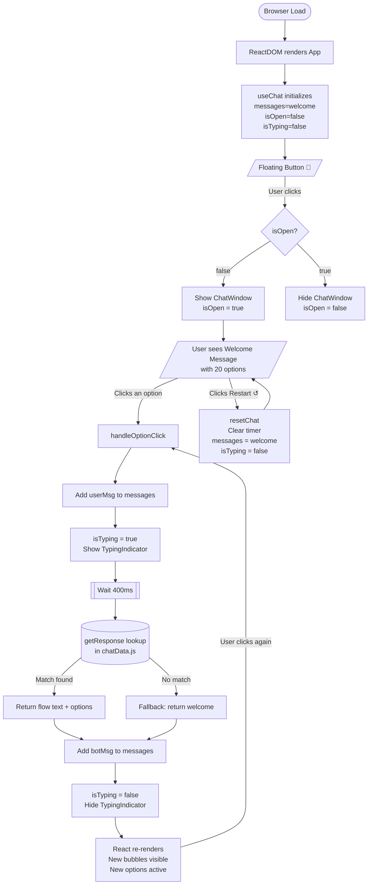

# Hospital Chatbot — Project Flow Reference

> This document maps every flow, state transition, and component interaction in the project.
> Use it as the source of truth when building a professional flowchart in Lucidchart, draw.io, Figma, or Mermaid.

---

## 1. Top-Level: Application Boot Flow

```
[Browser loads index.html]
        │
        ▼
[Vite injects main.jsx]
        │
        ▼
[ReactDOM.createRoot → renders <App />]
        │
        ▼
[App.jsx calls useChat()]
        │
        ├─ Initializes messages[] with [Welcome Bot Message]
        ├─ isOpen = false
        ├─ isTyping = false
        └─ timerRef = null
        │
        ▼
[App renders <ChatWidget />]
        │
        ├─ isOpen = false → shows only the Floating Button
        └─ isOpen = true  → shows Floating Button + ChatWindow
```

---

## 2. User Opens / Closes Chat

```
[User clicks Floating Button 🏥]
        │
        ▼
[toggleChat() fires]
        │
        ▼
[setIsOpen(!isOpen)]
        │
        ├─ isOpen = true  → ChatWindow appears (slide-in)
        └─ isOpen = false → ChatWindow hidden
```

---

## 3. Core Interaction Loop (Option Click)

This is the heart of the application. Every button click follows this exact path.

```
[User clicks an Option Button]
        │
        ▼
[handleOptionClick(optionKey) called]
        │
        ▼
[makeMessage(USER, optionKey)]
   → { id, sender:"user", text: optionKey, timestamp, options:[] }
        │
        ▼
[setMessages(prev => [...prev, userMsg])]
   → Cap check: if messages.length > 100, slice oldest
        │
        ▼
[setIsTyping(true)]
   → TypingIndicator renders (3-dot animation)
        │
        ▼
[setTimeout(400ms)]
        │
        ▼ (after 400ms)
[getResponse(optionKey)]   ← chatHelpers.js
        │
        ├─ optionKey === "Back to Main Menu" → returns chatData["welcome"]
        ├─ chatData[optionKey] exists        → returns chatData[optionKey]
        └─ No match found                   → returns chatData["welcome"] (fallback)
        │
        ▼
[makeMessage(BOT, response.text, response.options)]
   → { id, sender:"bot", text, timestamp, options:[] }
        │
        ▼
[setMessages(prev => [...prev, botMsg])]
        │
        ▼
[setIsTyping(false)]
   → TypingIndicator removed
        │
        ▼
[timerRef.current = null]
        │
        ▼
[React re-renders ChatWindow]
   → New MessageBubble (user) visible
   → New MessageBubble (bot) visible
   → OptionButtons rendered for latest bot message only
   → All previous OptionButtons disabled
```

---

## 4. Chat Reset Flow

```
[User clicks ↺ (Restart) button in header]
        │
        ▼
[resetChat() called]
        │
        ├─ clearTimeout(timerRef.current)  ← cancel any pending bot reply
        ├─ setIsTyping(false)
        └─ setMessages([Welcome Bot Message])
        │
        ▼
[Chat returns to initial state]
   → Only 1 message in list: the Welcome message
   → All 20 main menu options shown
```

---

## 5. Conversation Flow Map (All 27 Flows)

Each node below is a key in `chatData.js`. Arrows show which options lead where.

### Entry Point

```
[welcome]
  → Book / Cancel Appointment
  → Find a Doctor
  → Departments & Specialties
  → Emergency Services
  → OPD & IPD Information
  → Lab Tests & Reports
  → Pharmacy Information
  → Ambulance Services
  → Blood Bank
  → ICU / Critical Care
  → Insurance & Billing
  → Visiting Hours
  → Admission / Discharge Process
  → Health Packages & Checkups
  → Hospital Location & Directions
  → Contact Numbers
  → FAQs
  → Health Tips
  → Feedback / Complaints
  → COVID / Health Screening
```

### Level 1 → Level 2 Connections

```
[Book / Cancel Appointment]
  → OPD & IPD Information
  → Contact Numbers
  → Back to Main Menu ──────────────────────────────────┐
                                                         │
[Find a Doctor]                                          │
  → Cardiology ──────────────────── [Cardiology]        │
  │                                   → Book / Cancel Appointment
  │                                   → Back to Main Menu ──────┤
  → Orthopedics ─────────────────── [Orthopedics]       │
  │                                   → Book / Cancel Appointment
  │                                   → Back to Main Menu ──────┤
  → Neurology ───────────────────── [Neurology]         │
  │                                   → Book / Cancel Appointment
  │                                   → Back to Main Menu ──────┤
  → Pediatrics ──────────────────── [Pediatrics]        │
  │                                   → Book / Cancel Appointment
  │                                   → Back to Main Menu ──────┤
  → Gynecology ──────────────────── [Gynecology]        │
  │                                   → Book / Cancel Appointment
  │                                   → Back to Main Menu ──────┤
  → Dermatology ─────────────────── [Dermatology]       │
  │                                   → Book / Cancel Appointment
  │                                   → Back to Main Menu ──────┤
  → Back to Main Menu ────────────────────────────────────────┤
                                                               │
[Departments & Specialties]                                    │
  → Find a Doctor                                             │
  → Back to Main Menu ────────────────────────────────────────┤
                                                               │
[Emergency Services]                                           │
  → Ambulance Services                                        │
  → ICU / Critical Care                                       │
  → Back to Main Menu ────────────────────────────────────────┤
                                                               │
[OPD & IPD Information]                                        │
  → Book / Cancel Appointment                                  │
  → Back to Main Menu ────────────────────────────────────────┤
                                                               │
[Lab Tests & Reports]                                          │
  → OPD & IPD Information                                     │
  → Back to Main Menu ────────────────────────────────────────┤
                                                               │
[Pharmacy Information]                                         │
  → Back to Main Menu ────────────────────────────────────────┤
                                                               │
[Ambulance Services]                                           │
  → Emergency Services                                        │
  → Back to Main Menu ────────────────────────────────────────┤
                                                               │
[Blood Bank]                                                   │
  → Back to Main Menu ────────────────────────────────────────┤
                                                               │
[ICU / Critical Care]                                          │
  → Emergency Services                                        │
  → Back to Main Menu ────────────────────────────────────────┤
                                                               │
[Insurance & Billing]                                          │
  → Contact Numbers                                           │
  → Back to Main Menu ────────────────────────────────────────┤
                                                               │
[Visiting Hours]                                               │
  → Back to Main Menu ────────────────────────────────────────┤
                                                               │
[Admission / Discharge Process]                                │
  → OPD & IPD Information                                     │
  → Back to Main Menu ────────────────────────────────────────┤
                                                               │
[Health Packages & Checkups]                                   │
  → Book / Cancel Appointment                                  │
  → Back to Main Menu ────────────────────────────────────────┤
                                                               │
[Hospital Location & Directions]                               │
  → Back to Main Menu ────────────────────────────────────────┤
                                                               │
[Contact Numbers]                                              │
  → Back to Main Menu ────────────────────────────────────────┤
                                                               │
[FAQs]                                                         │
  → Back to Main Menu ────────────────────────────────────────┤
                                                               │
[Health Tips]                                                  │
  → Back to Main Menu ────────────────────────────────────────┤
                                                               │
[Feedback / Complaints]                                        │
  → Back to Main Menu ────────────────────────────────────────┤
                                                               │
[COVID / Health Screening]                                     │
  → Back to Main Menu ────────────────────────────────────────┘
                                    │
                                    ▼
                               [welcome]  (loop back to start)
```

---

## 6. Component Render Tree

```
<App>
  │
  ├── useChat()                         [Hook — no DOM]
  │     ├── state: messages[]
  │     ├── state: isOpen
  │     ├── state: isTyping
  │     ├── ref:   timerRef
  │     ├── fn:    toggleChat
  │     ├── fn:    handleOptionClick
  │     └── fn:    resetChat
  │
  └── <ChatWidget>
        │
        ├── [Floating Button]            (always visible)
        │     ├── 🏥 icon
        │     └── Red dot badge (if messages.length > 1 && !isOpen)
        │
        └── <ChatWindow>                 (only when isOpen = true)
              │
              ├── [Header]
              │     ├── "City Hospital" title
              │     ├── Green "Online" dot
              │     ├── ↺ Restart button → resetChat()
              │     └── ✕ Close button  → toggleChat()
              │
              ├── [Message Area]          (scrollable, auto-scroll to bottom)
              │     │
              │     └── For each message in messages[]:
              │           ├── <MessageBubble>
              │           │     ├── sender = "bot"  → left side, gray bubble, 🏥 avatar
              │           │     └── sender = "user" → right side, blue bubble, no avatar
              │           │
              │           └── <OptionButtons>         (only for bot messages)
              │                 ├── disabled = true   (all except last bot message)
              │                 └── disabled = false  (only the last bot message)
              │                       └── onClick → handleOptionClick(optionText)
              │
              ├── <TypingIndicator>        (only when isTyping = true)
              │     ├── 🏥 blue badge
              │     └── 3 animated bounce dots (staggered CSS animation)
              │
              └── [Footer]
                    └── "Powered by City Hospital"
```

---

## 7. State Lifecycle Summary

| Event | messages | isOpen | isTyping | timerRef |
|---|---|---|---|---|
| App boots | `[welcome msg]` | `false` | `false` | `null` |
| User opens chat | unchanged | `true` | unchanged | unchanged |
| User clicks option | `+userMsg` appended | unchanged | `true` | `setTimeout id` |
| 400ms elapses | `+botMsg` appended | unchanged | `false` | `null` |
| User clicks restart | `[welcome msg]` reset | unchanged | `false` | `null` (cleared) |
| User closes chat | unchanged | `false` | unchanged | unchanged |
| Component unmounts | — | — | — | `clearTimeout` called |

---

## 8. Data Layer: Key Resolution

```
[User clicks option with text "Cardiology"]
        │
        ▼
getResponse("Cardiology")           ← src/utils/chatHelpers.js
        │
        ├─ "Back to Main Menu"?  → return chatData["welcome"]
        ├─ chatData["Cardiology"] exists? → return chatData["Cardiology"]
        └─ else → return chatData["welcome"]  (graceful fallback)
        │
        ▼
Returns:
  {
    text: "Cardiology — Heart & Vascular Care\n...",
    options: ["Book / Cancel Appointment", "Back to Main Menu"]
  }
```

---

## 9. Message Object Shape

Every message in `messages[]` follows this structure:

```
{
  id:        string   // generateId() → Date.now() + random suffix
  sender:    "bot" | "user"
  text:      string   // display text (may contain \n)
  timestamp: string   // formatTimestamp() → "HH:MM AM/PM"
  options:   string[] // [] for user msgs; option labels for bot msgs
}
```

---

## 10. Flowbuilder Node Inventory

Use this as your node list when building the diagram:

| Node ID | Label | Shape |
|---|---|---|
| `START` | Browser Load | Rounded rect (start) |
| `APP_BOOT` | ReactDOM renders App | Process rect |
| `USECHAT_INIT` | useChat() initializes | Process rect |
| `FLOATING_BTN` | Floating Button 🏥 | Display shape |
| `TOGGLE_CHAT` | toggleChat() | Decision diamond |
| `CHAT_WINDOW` | ChatWindow visible | Process rect |
| `USER_CLICK` | User clicks option | Event shape |
| `ADD_USER_MSG` | Add user message | Process rect |
| `SHOW_TYPING` | isTyping = true | Process rect |
| `TIMER_400` | 400ms setTimeout | Delay shape |
| `GET_RESPONSE` | getResponse(key) | Process rect |
| `LOOKUP_DATA` | chatData lookup | Database shape |
| `ADD_BOT_MSG` | Add bot message | Process rect |
| `HIDE_TYPING` | isTyping = false | Process rect |
| `RERENDER` | React re-renders | Process rect |
| `RESET` | resetChat() | Process rect |
| `UNMOUNT` | clearTimeout cleanup | End shape |
| `WELCOME` | welcome flow | Data/doc shape |
| `FLOW_L1_01` | Book / Cancel Appt | Data/doc shape |
| `FLOW_L1_02` | Find a Doctor | Data/doc shape |
| `FLOW_L1_03` | Departments | Data/doc shape |
| `FLOW_L1_04` | Emergency Services | Data/doc shape |
| `FLOW_L1_05` | OPD & IPD Info | Data/doc shape |
| `FLOW_L1_06` | Lab Tests | Data/doc shape |
| `FLOW_L1_07` | Pharmacy | Data/doc shape |
| `FLOW_L1_08` | Ambulance | Data/doc shape |
| `FLOW_L1_09` | Blood Bank | Data/doc shape |
| `FLOW_L1_10` | ICU / Critical Care | Data/doc shape |
| `FLOW_L1_11` | Insurance & Billing | Data/doc shape |
| `FLOW_L1_12` | Visiting Hours | Data/doc shape |
| `FLOW_L1_13` | Admission / Discharge | Data/doc shape |
| `FLOW_L1_14` | Health Packages | Data/doc shape |
| `FLOW_L1_15` | Location & Directions | Data/doc shape |
| `FLOW_L1_16` | Contact Numbers | Data/doc shape |
| `FLOW_L1_17` | FAQs | Data/doc shape |
| `FLOW_L1_18` | Health Tips | Data/doc shape |
| `FLOW_L1_19` | Feedback / Complaints | Data/doc shape |
| `FLOW_L1_20` | COVID Screening | Data/doc shape |
| `FLOW_L2_01` | Cardiology | Data/doc shape |
| `FLOW_L2_02` | Orthopedics | Data/doc shape |
| `FLOW_L2_03` | Neurology | Data/doc shape |
| `FLOW_L2_04` | Pediatrics | Data/doc shape |
| `FLOW_L2_05` | Gynecology | Data/doc shape |
| `FLOW_L2_06` | Dermatology | Data/doc shape |

---

## 11. Mermaid Source (Copy-Paste Ready)

Paste into [mermaid.live](https://mermaid.live) to instantly preview the core interaction loop:



---

> **File:** `FLOW.md`  
> **Purpose:** Flowchart reference for professional diagram creation  
> **Source of truth files:** `src/hooks/useChat.js`, `src/data/chatData.js`, `src/utils/chatHelpers.js`
