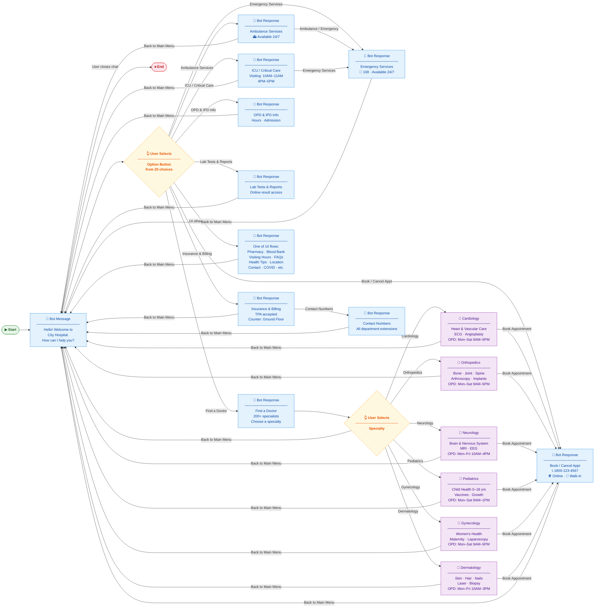
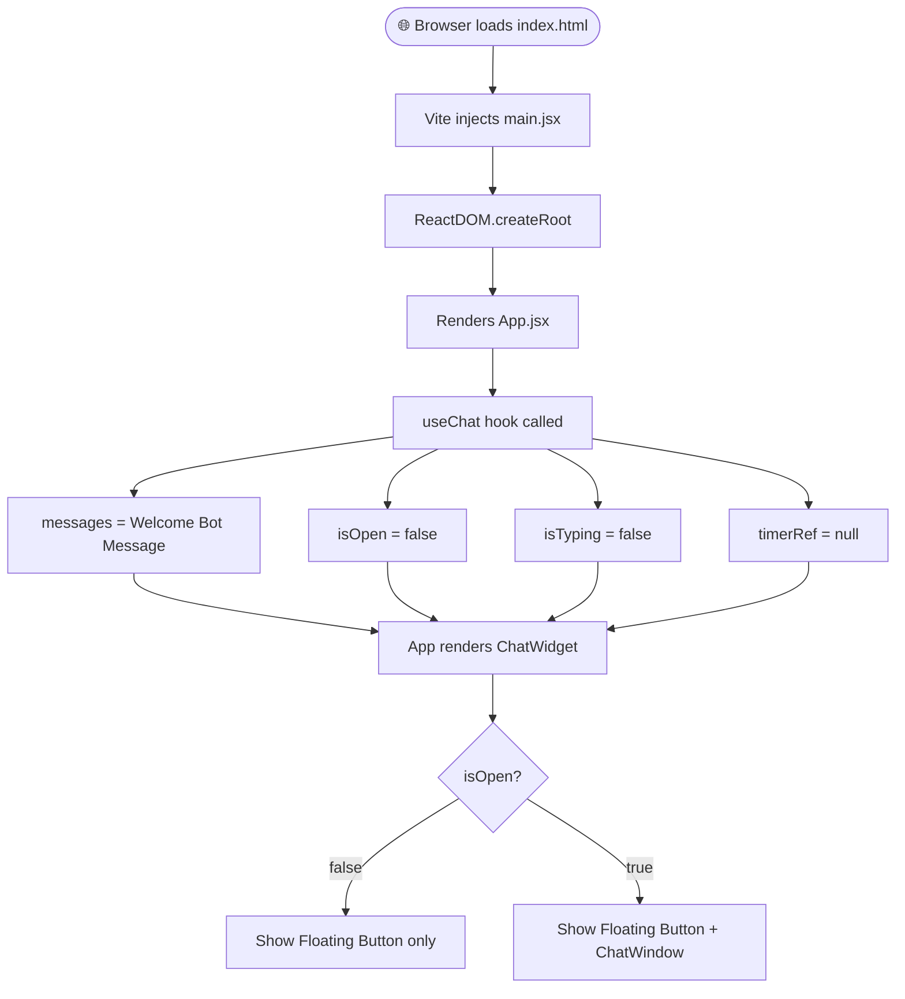
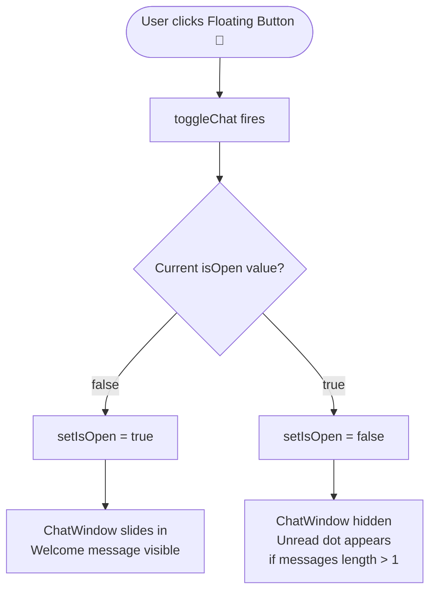
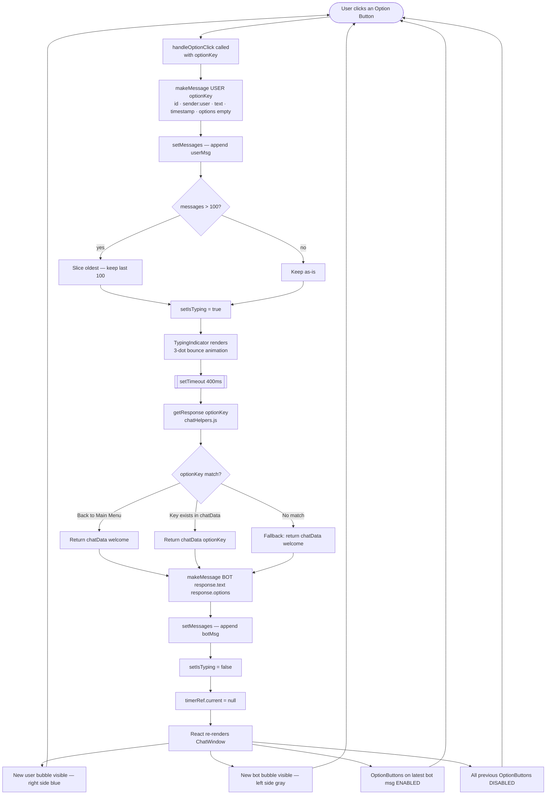
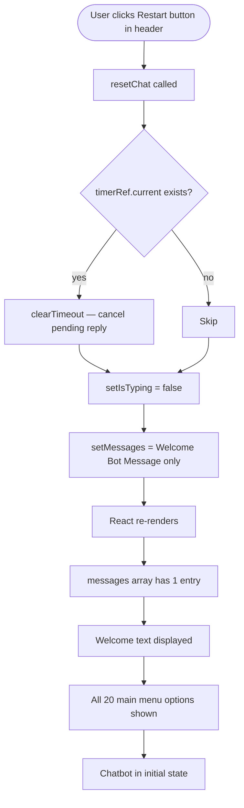
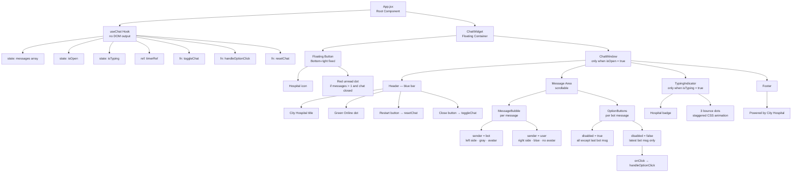
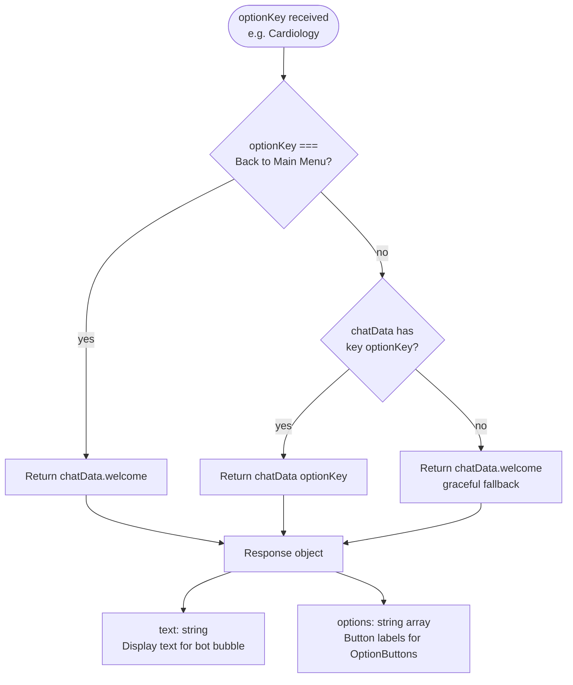
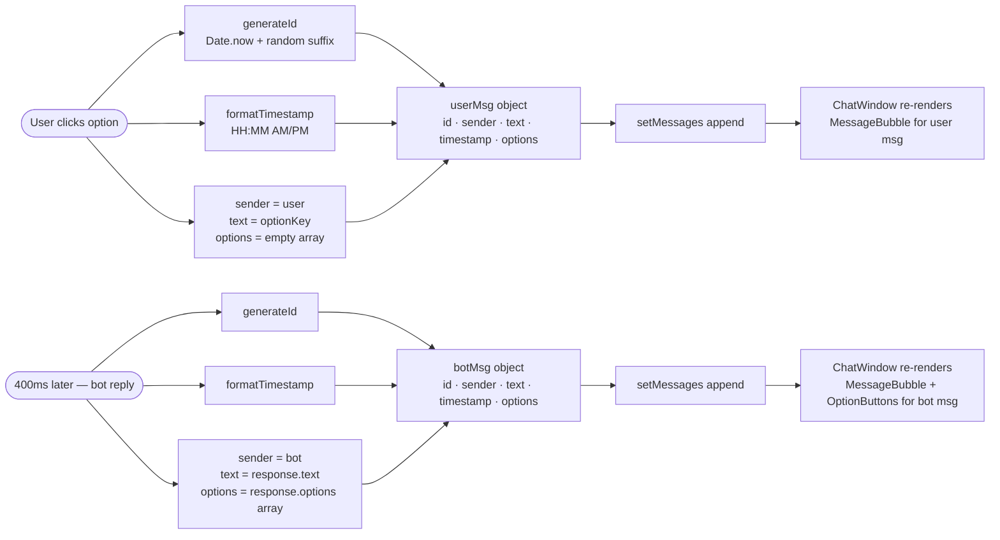

# Hospital Chatbot — Mermaid Diagrams for Figma

> Each diagram below is self-contained.
> Paste any block into https://mermaid.live → Export SVG → Import into Figma.

---

## Diagram 0 — Chatbot Conversation Flow (Voiso-style)

Matches the card + labeled-edge + LR layout style of visual flowbuilders.



---

## Diagram 1 — Application Boot Flow



---

## Diagram 2 — Open & Close Chat



---

## Diagram 3 — Core Interaction Loop



---

## Diagram 4 — Chat Reset Flow



---

## Diagram 5 — Conversation Flow Map

```mermaid
flowchart TD
    W([WELCOME\nHello! Welcome to City Hospital])

    W --> L01[Book / Cancel Appointment]
    W --> L02[Find a Doctor]
    W --> L03[Departments & Specialties]
    W --> L04[Emergency Services]
    W --> L05[OPD & IPD Information]
    W --> L06[Lab Tests & Reports]
    W --> L07[Pharmacy Information]
    W --> L08[Ambulance Services]
    W --> L09[Blood Bank]
    W --> L10[ICU / Critical Care]
    W --> L11[Insurance & Billing]
    W --> L12[Visiting Hours]
    W --> L13[Admission / Discharge Process]
    W --> L14[Health Packages & Checkups]
    W --> L15[Hospital Location & Directions]
    W --> L16[Contact Numbers]
    W --> L17[FAQs]
    W --> L18[Health Tips]
    W --> L19[Feedback / Complaints]
    W --> L20[COVID / Health Screening]

    L01 --> L05
    L01 --> L16
    L01 --> W

    L02 --> S1[Cardiology]
    L02 --> S2[Orthopedics]
    L02 --> S3[Neurology]
    L02 --> S4[Pediatrics]
    L02 --> S5[Gynecology]
    L02 --> S6[Dermatology]
    L02 --> W

    S1 --> L01
    S1 --> W
    S2 --> L01
    S2 --> W
    S3 --> L01
    S3 --> W
    S4 --> L01
    S4 --> W
    S5 --> L01
    S5 --> W
    S6 --> L01
    S6 --> W

    L03 --> L02
    L03 --> W

    L04 --> L08
    L04 --> L10
    L04 --> W

    L05 --> L01
    L05 --> W

    L06 --> L05
    L06 --> W

    L07 --> W

    L08 --> L04
    L08 --> W

    L09 --> W

    L10 --> L04
    L10 --> W

    L11 --> L16
    L11 --> W

    L12 --> W

    L13 --> L05
    L13 --> W

    L14 --> L01
    L14 --> W

    L15 --> W
    L16 --> W
    L17 --> W
    L18 --> W
    L19 --> W
    L20 --> W
```



---

## Diagram 6 — Component Render Tree



---

## Diagram 7 — State Lifecycle

```mermaid
stateDiagram-v2
    [*] --> Booted : ReactDOM renders App

    state Booted {
        messages : Welcome message only
        isOpen : false
        isTyping : false
        timerRef : null
    }

    Booted --> ChatOpen : User clicks Floating Button
    ChatOpen --> Booted : User clicks Close button

    state ChatOpen {
        isOpen : true
    }

    ChatOpen --> WaitingForBot : User clicks an option
    state WaitingForBot {
        messages : + userMsg appended
        isTyping : true
        timerRef : setTimeout id
    }

    WaitingForBot --> BotReplied : 400ms elapses
    state BotReplied {
        messages : + botMsg appended
        isTyping : false
        timerRef : null
    }

    BotReplied --> WaitingForBot : User clicks next option
    BotReplied --> Booted : User clicks Restart

    Booted --> [*] : Component unmounts\nclearTimeout called
```

---

## Diagram 8 — Data Resolution (chatHelpers.js)



---

## Diagram 9 — Message Object Lifecycle



---

> **How to use in Figma:**
> 1. Copy one diagram block (the triple-backtick mermaid block)
> 2. Paste into https://mermaid.live
> 3. Click **Export → SVG**
> 4. In Figma: **Import** or drag-drop the SVG file
> 5. Ungroup to edit individual nodes and labels
